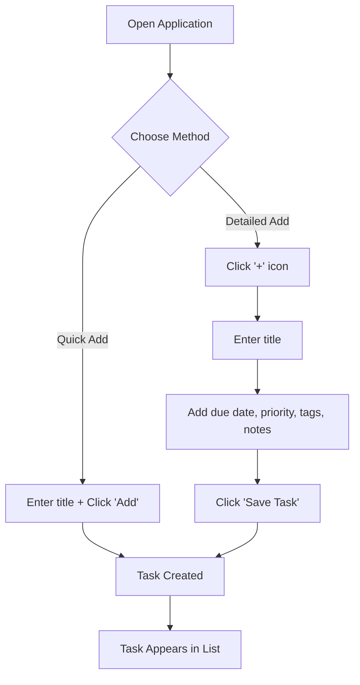
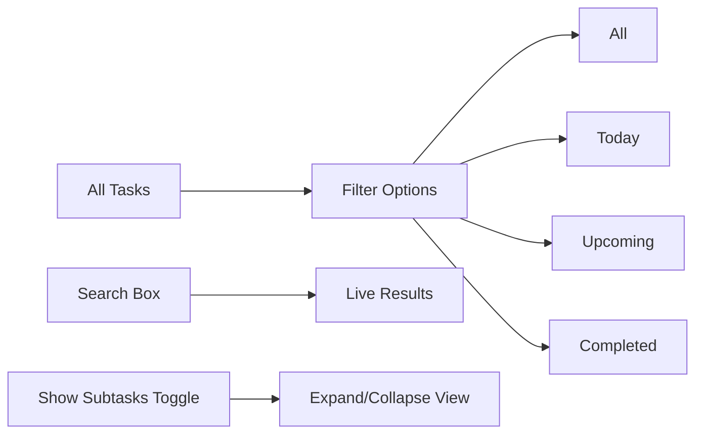
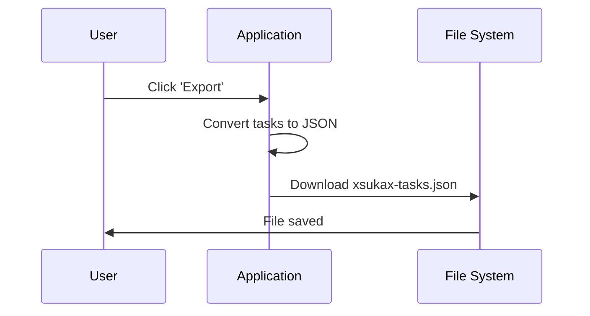
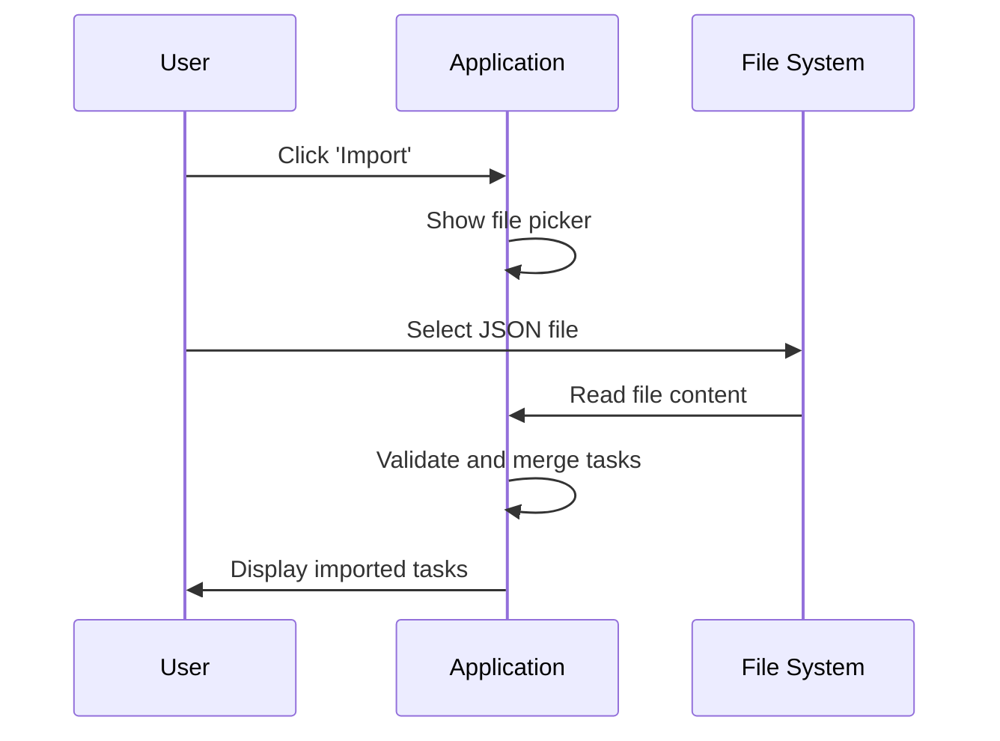
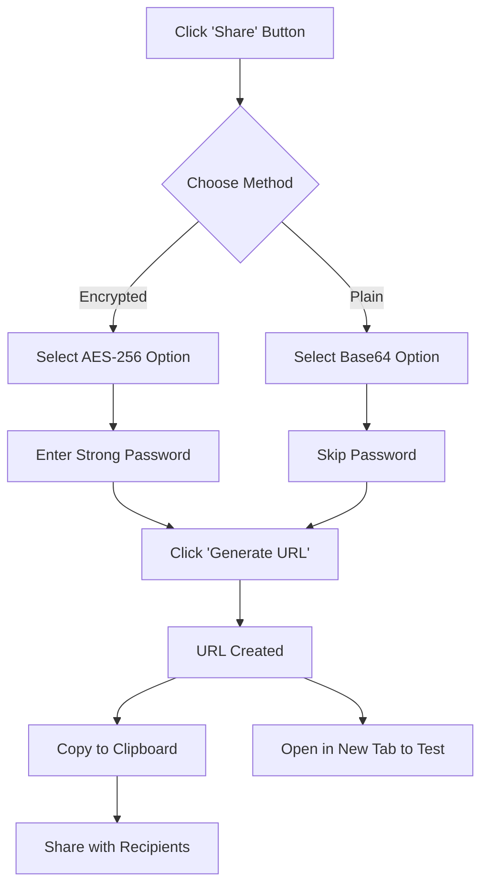
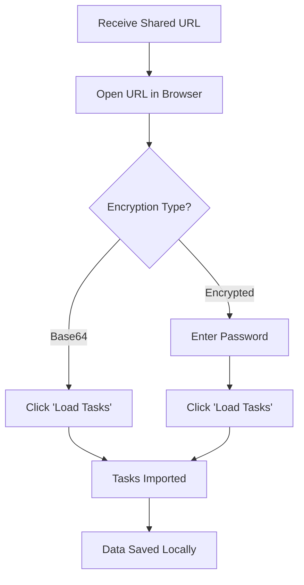
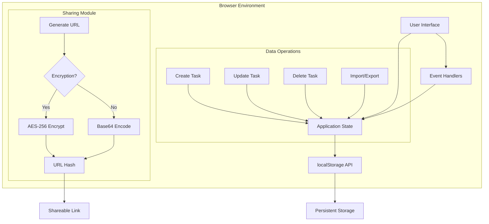

# xsukax To-Do List


A privacy-first, feature-rich task management application that runs entirely in your browser with no server dependencies.

[Live Demo](https://xsukax.github.io/xsukax-To-Do-List) • [Report Bug](https://github.com/xsukax/xsukax-To-Do-List/issues) • [Request Feature](https://github.com/xsukax/xsukax-To-Do-List/issues)

---

## 📋 Project Overview

**xsukax To-Do List** is a sophisticated, client-side task management application designed for individuals and teams who prioritize data privacy and offline functionality. Built as a single-page application (SPA), it leverages modern web technologies to deliver a complete task management solution without requiring any backend infrastructure, user registration, or external data transmission.

The application provides comprehensive task organization capabilities including hierarchical subtasks, priority management, due date tracking, tagging systems, and advanced filtering—all while ensuring your data never leaves your device unless you explicitly choose to share it.

### Core Philosophy

- **Privacy by Design**: Zero data collection, no analytics, no tracking
- **Offline-First**: Fully functional without internet connectivity
- **Self-Contained**: Single HTML file with no external dependencies (except CDN resources)
- **User Sovereignty**: Complete control over your data with local storage and encrypted sharing options

---

## 🔒 Security and Privacy Benefits

### Client-Side Architecture

All data processing occurs exclusively within the browser environment. The application does not communicate with any remote servers, ensuring that your tasks, notes, and personal information remain private and under your complete control.

### Local Data Storage

Task data is persisted using the browser's `localStorage` API, which means:
- **No Cloud Dependency**: Data resides solely on your local device
- **No Account Required**: No registration, login, or personal information collection
- **Instant Access**: No authentication delays or session management
- **Complete Ownership**: You retain full control and can delete data at any time

### Encrypted Sharing

When sharing task lists, the application offers two security models:

1. **AES-256 Encryption**: Implements industry-standard Advanced Encryption Standard with 256-bit keys
   - Password-based encryption protects shared data
   - Only recipients with the correct password can decrypt
   - Encrypted data is unintelligible without the decryption key
   - Suitable for sensitive or confidential task lists

2. **Base64 Encoding**: Provides basic obfuscation without encryption
   - No password required
   - Faster to generate and share
   - Appropriate for non-sensitive information
   - URL-safe encoding format

### Zero External Dependencies for Core Functionality

While the application uses CDN-hosted libraries (Tailwind CSS and CryptoJS) for styling and encryption, the core task management functionality operates independently. Users can optionally download and host these resources locally for complete air-gapped operation.

### No Analytics or Tracking

The application contains no analytics frameworks, tracking pixels, or third-party integrations that could compromise user privacy. Your workflow patterns, task content, and usage habits remain completely private.

---

## ✨ Features and Advantages

### Comprehensive Task Management

- **Quick Task Creation**: Rapidly add tasks with a single click or keyboard shortcut
- **Detailed Task Properties**: 
  - Customizable due dates and times
  - Three priority levels (Low, Medium, High)
  - Multiple tags for categorization
  - Rich text notes for additional context
- **Hierarchical Subtasks**: Break down complex tasks into manageable components
- **Task Completion Tracking**: Visual indicators for progress monitoring

### Advanced Organization

- **Smart Filtering**: View tasks by status (All, Today, Upcoming, Completed)
- **Real-Time Search**: Instantly find tasks by title, tags, or notes
- **Subtask Visibility Control**: Toggle between compact and expanded views
- **Automatic Sorting**: Tasks organized by completion status, due date, and creation time

### Data Portability

- **JSON Export**: Download your entire task database in a standard, human-readable format
- **File Import**: Restore tasks from previously exported JSON files with drag-and-drop interface
- **Merge Capability**: Import tasks without overwriting existing data
- **Cross-Platform Compatible**: Transfer tasks between different devices and browsers

### Collaborative Sharing

- **Shareable URLs**: Generate links containing your task list
- **Dual Encoding Methods**: Choose between encrypted (secure) or base64 (convenient) sharing
- **Test Before Sharing**: Built-in "Open in New Tab" feature for verification
- **One-Click Copy**: Instant clipboard integration for easy distribution

### User Experience

- **GitHub-Inspired Design**: Clean, professional interface familiar to developers
- **Fully Responsive**: Optimized for desktop, tablet, and mobile devices
- **Keyboard Shortcuts**: Enhanced productivity with Enter key support
- **Visual Feedback**: Real-time notifications for all operations
- **No Page Reloads**: Seamless single-page application experience

### Performance Benefits

- **Instant Load Times**: No server requests or API calls
- **Offline Capability**: Works without internet connectivity
- **Minimal Resource Usage**: Lightweight architecture with efficient rendering
- **No Latency**: All operations execute locally with immediate response

---

## 🚀 Installation Instructions

### Method 1: Direct Browser Usage (Recommended)

1. **Download the Application**
   ```bash
   # Clone the repository
   git clone https://github.com/xsukax/xsukax-To-Do-List.git
   
   # Navigate to the directory
   cd xsukax-To-Do-List
   ```

2. **Open in Browser**
   - Locate `index.html` in your file system
   - Double-click to open in your default browser
   - Alternatively, right-click → Open With → Choose your preferred browser

3. **Bookmark for Quick Access** (Optional)
   - Press `Ctrl+D` (Windows/Linux) or `Cmd+D` (macOS)
   - Save the bookmark for future access

### Method 2: Local Web Server

For users who prefer serving the application via HTTP:

```bash
# Using Python 3
python -m http.server 8000

# Using Node.js with http-server
npx http-server -p 8000

# Using PHP
php -S localhost:8000
```

Navigate to `http://localhost:8000/index.html` in your browser.

### Method 3: GitHub Pages Deployment

Deploy your own instance:

1. Fork the repository to your GitHub account
2. Navigate to Settings → Pages
3. Select the main branch as the source
4. Access your instance at `https://yourusername.github.io/xsukax-To-Do-List`

### Browser Compatibility

- **Chrome/Edge**: Version 90+
- **Firefox**: Version 88+
- **Safari**: Version 14+
- **Opera**: Version 76+

**Requirements**: JavaScript must be enabled; LocalStorage must be permitted.

---

## 📖 Usage Guide

### Getting Started

#### Creating Your First Task



**Quick Add**: Type your task in the input field and press Enter or click "Add"

**Detailed Add**: Click the '+' icon to expand the form and add:
- Due date and time
- Priority level
- Comma-separated tags
- Detailed notes

#### Managing Tasks

1. **Complete a Task**: Click the circle checkbox next to the task title
2. **Edit a Task**: Click the pencil icon to open the detailed editor
3. **Delete a Task**: Click the trash icon (with confirmation prompt)
4. **Add Subtasks**: Open task editor → Add subtasks → Save

### Advanced Features

#### Filtering and Searching



- **All**: Display all tasks regardless of status
- **Today**: Show only tasks due today
- **Upcoming**: Display future tasks with due dates
- **Completed**: View finished tasks
- **Search**: Type to filter by title, tags, or notes

#### Working with Subtasks

**Collapsed View** (Default):
- Shows summary: "X of Y subtasks completed"
- Clean, minimal interface

**Expanded View**:
1. Enable "Show Subtasks" checkbox
2. Subtasks appear with individual checkboxes
3. Check/uncheck directly from homepage
4. Strikethrough indicates completion

#### Data Management

##### Exporting Tasks



**Steps**:
1. Click "Export" button in header
2. Browser downloads `xsukax-tasks.json`
3. File saved to default downloads folder

##### Importing Tasks



**Steps**:
1. Click "Import" button
2. Click "Choose JSON File"
3. Select your exported `.json` file
4. Click "Import" to merge with existing tasks

**Note**: Duplicate tasks (matching IDs) are automatically excluded.

#### Sharing Task Lists

##### Encryption Workflow



**Encrypted Sharing** (Recommended for sensitive data):
1. Click "Share" button
2. Select "AES-256 Encrypted"
3. Enter a strong password (share separately with recipient)
4. Click "Generate URL"
5. Copy URL or open in new tab to verify
6. Provide password to recipient through secure channel

**Base64 Sharing** (Convenient for non-sensitive data):
1. Click "Share" button
2. Select "Base64 Encoded"
3. Click "Generate URL"
4. Copy and share URL directly

##### Receiving Shared Lists



**Steps**:
1. Open the shared URL
2. If encrypted, enter the password provided by sender
3. Click "Load Tasks"
4. Tasks are imported and saved to your local storage

### Application Architecture



### Data Structure

Tasks are stored as JSON objects with the following schema:

```json
{
  "id": "1699123456789",
  "title": "Complete project documentation",
  "completed": false,
  "createdAt": "2025-11-12T10:30:00.000Z",
  "dueDate": "2025-11-15T17:00:00.000Z",
  "priority": "high",
  "tags": ["work", "documentation"],
  "notes": "Include API reference and usage examples",
  "subtasks": [
    {
      "title": "Write introduction",
      "completed": true
    },
    {
      "title": "Add code examples",
      "completed": false
    }
  ]
}
```

### Best Practices

1. **Regular Backups**: Export your tasks weekly to prevent data loss
2. **Strong Passwords**: Use complex passwords for encrypted sharing
3. **Browser Storage**: Be aware that clearing browser data will delete tasks
4. **Cross-Device Sync**: Use export/import or sharing features to transfer between devices
5. **Subtask Organization**: Keep subtask lists focused (5-10 items maximum)

### Keyboard Shortcuts

- `Enter` in task input: Quick add task
- `Enter` in subtask input: Add subtask
- `Ctrl/Cmd + D`: Bookmark the application (browser default)

---

## 🛠️ Technical Stack

- **HTML5**: Semantic markup and structure
- **Tailwind CSS 3.x**: Utility-first CSS framework via CDN
- **Vanilla JavaScript (ES6+)**: Modern JavaScript features
- **CryptoJS 4.1.1**: AES encryption implementation
- **LocalStorage API**: Browser-based data persistence

---

## 🔧 Configuration

### Customizing Storage Key

The application uses the localStorage key `xsukax-tasks`. To customize:

```javascript
// In the source code, locate:
localStorage.getItem('xsukax-tasks')

// Replace with your custom key:
localStorage.getItem('my-custom-key')
```

### Offline CDN Resources

For complete offline operation, download and host locally:

```html
<!-- Replace CDN links in index.html -->
<script src="./js/tailwind.min.js"></script>
<script src="./js/crypto-js.min.js"></script>
```

---

## 🤝 Contributing

Contributions are welcome! Please follow these guidelines:

1. Fork the repository
2. Create a feature branch (`git checkout -b feature/AmazingFeature`)
3. Commit your changes (`git commit -m 'Add some AmazingFeature'`)
4. Push to the branch (`git push origin feature/AmazingFeature`)
5. Open a Pull Request

### Development Guidelines

- Maintain the single-file architecture
- Preserve privacy-first principles
- Ensure all features work offline
- Test across multiple browsers
- Follow existing code style and conventions

---

## 📝 License

This project is licensed under the GNU General Public License v3.0.

---

## 🐛 Known Issues

- Browser storage limits (typically 5-10MB) may restrict very large task databases
- Shared URLs can become extremely long with large datasets
- Some mobile browsers may have localStorage restrictions in private/incognito mode

---

## 🗺️ Roadmap

- [ ] Drag-and-drop task reordering
- [ ] Recurring tasks
- [ ] Task templates
- [ ] Color-coded categories
- [ ] Keyboard navigation shortcuts
- [ ] Dark mode theme
- [ ] CSV export option
- [ ] Task statistics dashboard

---

## 🙏 Acknowledgments

- Tailwind CSS team for the excellent utility framework
- CryptoJS maintainers for robust encryption
- The open-source community for inspiration and best practices

---

<div align="center">

**Made with ❤️ by xsukax**

If this project helps you, please consider giving it a ⭐ on [GitHub](https://github.com/xsukax/xsukax-To-Do-List)!

</div>
